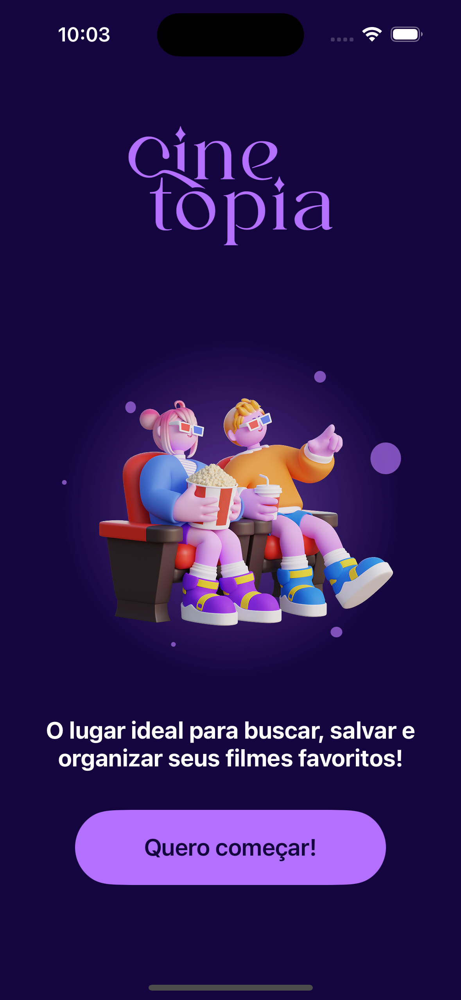
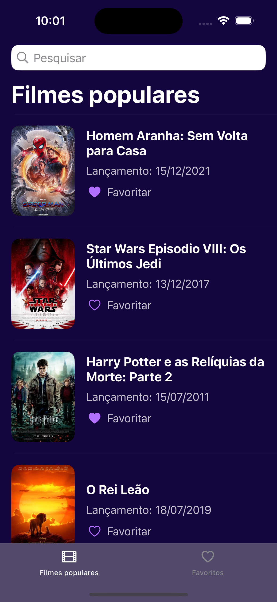
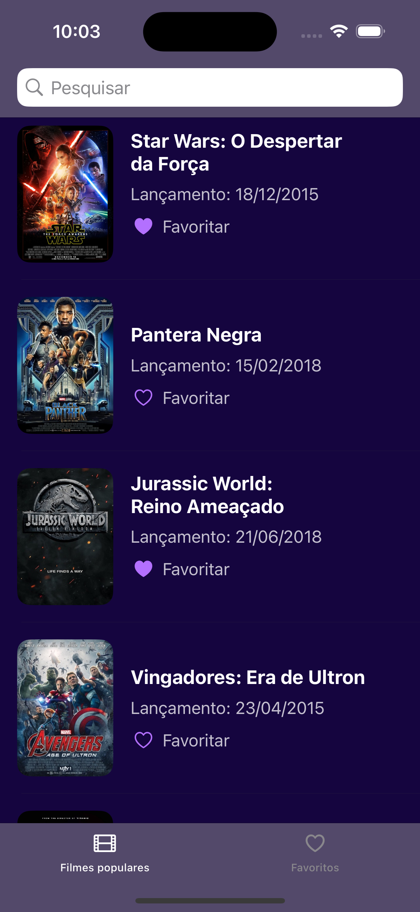
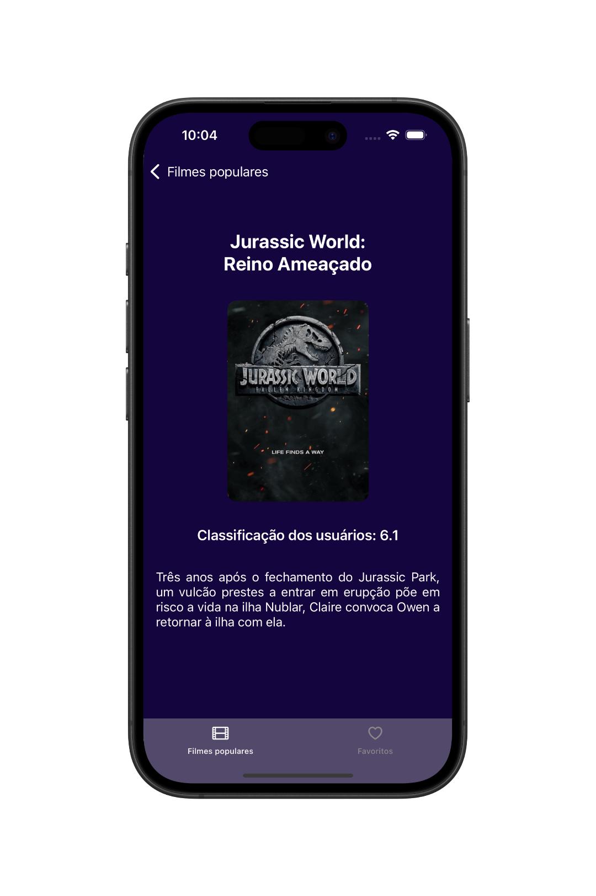
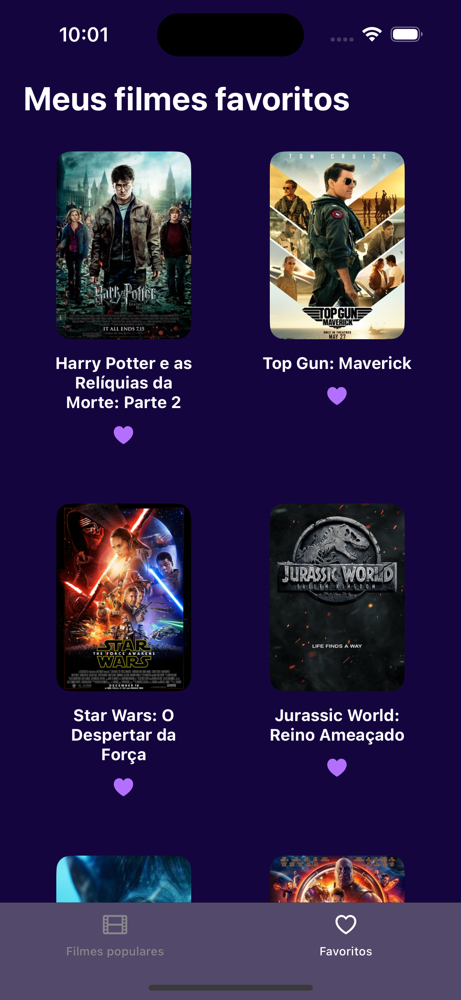

# 📱 Cinetopia - App de Filmes

O **Cinetopia** é um aplicativo iOS desenvolvido com **UIKit (ViewCode)** que permite aos usuários explorar filmes populares, pesquisar títulos e marcar seus favoritos. A interface é moderna, responsiva e centrada na experiência do usuário.

  
  
  
  
  
  

## 🛠 Tecnologias Utilizadas

- Swift  
- UIKit
- ViewCode 
- Auto Layout (NSLayoutConstraint)
- UITableView e UICollectionView
- UISearchBar
- UITabBarController
- Dependência Externa Via SPM (Kingfisher)
- API REST (URLSession: async/await)
- MVC (Model-View-Controller)  

## 👨🏻‍💻 Como Usar o Aplicativo

- Baixe o projeto e abra com o Xcode.
- Execute o aplicativo em um simulador iOS ou iPhone físico.
- Na tela inicial, toque em **Quero começar!**.
- Navegue entre os filmes populares e utilize a busca para encontrar títulos específicos.
- Toque no coração de **Favoritar** para salvar um filme na aba de favoritos.
- Toque em qualquer filme para visualizar sua descrição, imagem e classificação.
- Acesse seus filmes favoritos tocando na aba **Favoritos**.

## 📌 Observação

Este projeto foi desenvolvido com fins educacionais como prática de desenvolvimento iOS utilizando **UIKit** com **ViewCode**, consumo de **API REST** com `async/await` e estruturação limpa em camadas com o padrão **MVC**.
